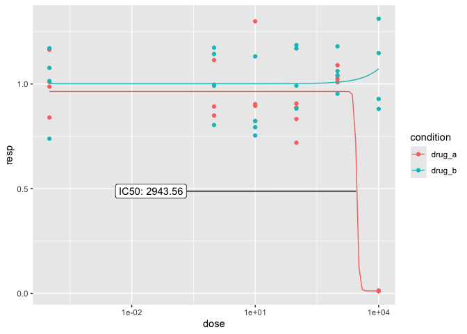

<!-- README.md is generated from README.Rmd. Please edit that file -->

# ezmtt

<!-- badges: start -->

<!-- badges: end -->

ezmtt is a package for analyzing MTT assay data - namely, fitting and
plotting curves and calculating IC%.

It mainly serves as a ‘companion package’ for the protocol
[here](https://kai.quarto.pub/bok/mtt.html), but is flexible enough to
support a variety of plate layouts.

## Installation

You can install the development version of ezmtt from
[GitHub](https://github.com/) with:

``` r
# install.packages("devtools")
devtools::install_github("KaiAragaki/ezmtt")
```

## Example

``` r
library(ezmtt)

mtt |>
  mtt_fit(conditions = list(
    drug_a = c(0, 1, 10, 100, 1000, 10000),
    drug_b = c(0, 1, 10, 100, 1000, 10000),
    NA,
    NA
  )) |>
  mtt_plot(ic_pct = 50)
#> Lowest dose is 0, converting to 1e-04
#> Lowest dose is 0, converting to 1e-04
#> Warning in sqrt(dEDval %*% varCov %*% dEDval): NaNs produced
#> Warning in sqrt(dEDval %*% varCov %*% dEDval): NaNs produced
#> Warning in sqrt(dEDval %*% varCov %*% dEDval): NaNs produced
#> Warning in sqrt(dEDval %*% varCov %*% dEDval): NaNs produced
#> Warning in sqrt(diag(varMat)): NaNs produced
#> Warning in sqrt(diag(varMat)): NaNs produced
```


